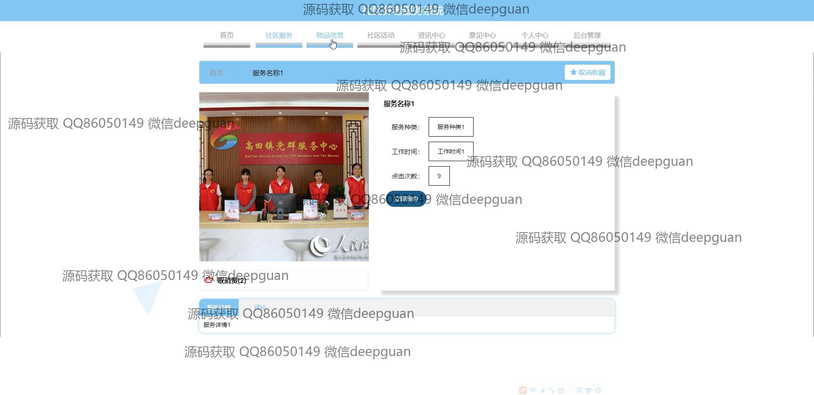
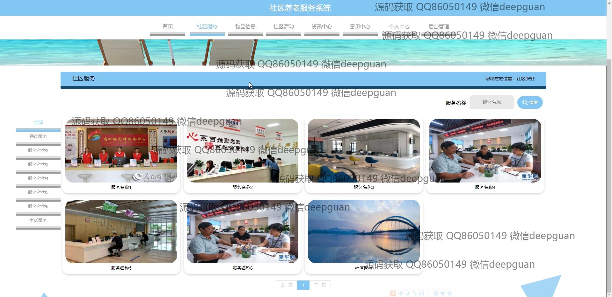

<h1 align="center">社区养老服务系统</h1>

## 简介
社区养老服务系统：角色分为管理员、用户；主要功能包括用户管理、服务预约、活动发布、疫情监测、物业收费、物品和资讯管理，旨在提升老年人生活质量和社区互动。    --计算机毕业设计源码；毕设源码；java毕业设计源码

## 联系方式

<h3 align="center">获取完整代码与数据库文件 + 微信：deepguan QQ: 86050149 QQ群: 783742310</h3>

<h3 align="center">可帮忙远程部署 包运行成功！提供远程部署、修改代码、设计文档指导、代码讲解等服务！</h3>

## 功能介绍（完整见运行截图）
管理员：维护用户账户信息，管理服务预约、物品及活动信息，更新和管理系统中的轮播图，处理用户反馈，发布资讯，监控和记录疫情相关数据，管理物业收费，确保数据准确性和系统稳定性。  
用户：注册和登录系统，查看并管理个人信息，通过社区服务模块预约和访问养老服务，参与社区活动，使用个人中心查看历史记录和上传健康码，记录健康状态，浏览并评论社区资讯。  
工作人员：添加和编辑服务项目，管理用户预约信息，上传物品和活动的详细信息，处理服务相关的评论和反馈，监督服务质量。  
志愿者：浏览可参与的社区服务项目，查看活动详情，参与志愿服务，记录服务信息和反馈，协助管理员维持系统运营和信息更新。

## 运行截图

本代码来源于网络,仅供学习参考使用!

